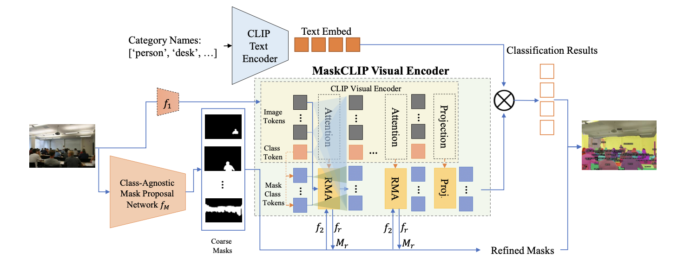

# Open-Vocabulary Universal Image Segmentation with MaskCLIP (ICML 2023)

[Zheng Ding](mailto:zhding@ucsd.edu), [Jieke Wang](), [Zhuowen Tu](http://www.cogsci.ucsd.edu/~ztu/)

[Arxiv](https://arxiv.org/abs/2208.08984) / [Project](https://maskclip.github.io) / [Video](https://youtu.be/nW0GYkLtka8)



### Data preparation

For COCO and ADE20k data preparation, please refer to [Preparing Datasets in Mask2Former](https://github.com/facebookresearch/Mask2Former/tree/main/datasets).

### Environment Setup

Please follow the following codes to set up the environment.

```
conda create -n maskclip python=3.9
conda activate maskclip
conda install pytorch=1.10 cudatoolkit=11.3 torchvision=0.11 -c pytorch -c conda-forge
python -m pip install detectron2 -f https://dl.fbaipublicfiles.com/detectron2/wheels/cu113/torch1.10/index.html
pip install setuptools==59.5.0
pip install timm opencv-python scipy einops
pip install git+https://github.com/openai/CLIP.git
pip install git+https://github.com/cocodataset/panopticapi.git

cd mask2former/modeling/pixel_decoder/ops/
sh make.sh
```

### Training

#### Training Class-Agnostic Mask Proposal Network

You can train a class-agnostic mask proposal network by removing the classification head of previous segmentation models e.g., Mask2Former, MaskRCNN. We provide our trained class-agnostic mask proposal network [here](https://drive.google.com/file/d/1NdXOUzJVQUdl0V0HkQ0yFMUa2MJQojiv/view?usp=sharing).

#### Training MaskCLIP on COCO dataset

With the trained class-agnostic mask proposal network, we can train the MaskCLIP model through the following command. We train our model for 10,000 iterations with a batch size of 8.

```
python train_net.py --num-gpus 8 --config-file configs/coco/maskformer2_R50_bs16_50ep.yaml
```

### Testing MaskCLIP on ADE20K dataset

You can test our model on ADE20K dataset to get the results using the trained model. We also provide our trained model [here](https://drive.google.com/file/d/1fzf4y-l-BwhBkxambk_yS4yrCwHOKij7/view?usp=sharing). You need to change the path of `MODEL.WEIGHTS` in the yaml file.

```
python train_net.py --num-gpus 1 --config-file configs/ade20k/maskformer2_R50_bs16_160k.yaml --eval-only
``` 

## Citation

If you find this work helpful, please consider citing MaskCLIP using the following BibTeX entry.

```BibTeX
@inproceedings{ding2023maskclip,
  author    = {Zheng Ding, Jieke Wang, Zhuowen Tu},
  title     = {Open-Vocabulary Universal Image Segmentation with MaskCLIP},
  booktitle = {International Conference on Machine Learning},
  year      = {2023},
}
```

Please also checkout [MasQCLIP](https://github.com/mlpc-ucsd/MasQCLIP) for out lastest work on open-vocabulary segmentation.


## Acknowledgement

This codebase was built upon and drew inspirations from [CLIP](https://github.com/openai/CLIP) and [Mask2Former](https://github.com/facebookresearch/Mask2Formersss). We thank the authors for making those repositories public.
